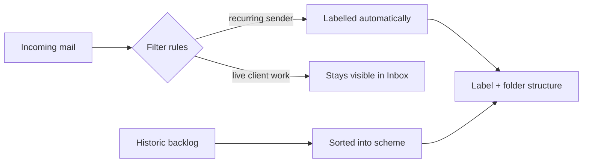

# Business Mailbox Organization — client case studies

`SANITIZED CLIENT CASE STUDIES`

**Project type:** Sanitized client case studies
**Evidence sources:** completed Fiverr orders, public client reviews, historical account audit
**Status:** delivered

A record of repeat client work reorganising overloaded business Gmail accounts
into inboxes their owners can actually run a week from.

> This repository contains **no message content, no email addresses, no sender
> names, no screenshots of anyone's mailbox and no client identifiers.** The
> label taxonomies are built per client and are not published. What is here is
> the shape of the problem, how it is approached, and the public client
> feedback on the result.

---

## Verified delivery volume

`AUDITED 26 SEPTEMBER 2026`

Counts below are read from the platform's own completed-order list, not from memory.

| | |
|---|---|
| Completed orders in this service line | **27** |
| Of those, carrying a buyer rating | **14** |
| Ratings observed | all 5 stars |
| Largest single engagement observed | $850 |
| Reviewed window | February 2025 – September 2026 |

**Repeat business.** Within the reviewed window, more than one buyer placed
several separate orders against this service, months apart. That is the
strongest signal in the whole record: a mailbox scheme that a client comes back
to extend is one that survived contact with their actual week.

**Scope of the audit.** 103 of 221 completed orders were individually reviewed
before the platform presented a human-verification step and the audit stopped
there. The 27 above are counted from those 103. Older orders in this service line
exist among the remaining 118 and are deliberately not estimated.

**What the count does and does not say.** The 27 are Gmail label, filter and
folder engagements delivered under one service line. The Microsoft 365 work
described further down is a separate engagement and is not included in that
number.

---

## Problem

A business mailbox that has been running for years without a system ends up in
the same state: a large backlog, no usable labels, and real work — a client
reply, an invoice, a supplier confirmation — sitting in the same undifferentiated
list as newsletters and platform notifications. Search becomes the only way to
navigate, so anything the owner cannot remember the wording of is effectively
lost, and the time cost lands on whoever owns the account.

What these clients asked for was not deletion. It was to be able to find things,
and for tomorrow's mail to sort itself.

## Constraints

- Access is to the **client's own account**, granted and revoked by them. No
  credentials are stored and no mailbox data is exported or copied anywhere.
- Scope — and anything destructive — is agreed before the work starts.
- The result has to keep working after handover: the filters run on their own
  and the label scheme has to be one the owner can explain to a colleague.

## What is delivered

The service, as it is scoped and as clients have described receiving it:

- **The inbox cleaned and organised** — the backlog moved out of the inbox and
  into a structure, rather than left as one undifferentiated pile.
- **A label and folder scheme** for the account, built around how that
  particular business works.
- **Filters** so that incoming mail arrives already labelled and the inbox does
  not simply refill.

## Architecture

## Engagements

### Gmail

Four representative engagements from the 27 counted above:

| When | Client | Turnaround | Notes |
|---|---|---|---|
| Aug 2026 | United Kingdom | 1 day | Full inbox reorganisation with labels, filters and folders |
| Aug 2026 | United States | 2 days | Inbox cleaning and reorganisation |
| Aug 2026 | United States | 9 days | Larger mailbox; ongoing collaboration since |
| Sep 2026 | United States | 2 days | Repeat client, several projects |

Two of these four became ongoing working relationships, which is the outcome I
care about most — the scheme held up after handover. In the account history this
service is the clearest repeat-business line of anything I sell: the large
majority of email-work earnings come from returning buyers rather than new ones.

### Microsoft 365 — services business

The same problem in Outlook rather than Gmail.

The constraint that shaped the whole job: **new and important mail had to stay
visible in the main Inbox.** No rule was permitted to move live operational mail
out of it. That rules out the usual "filter everything into folders" approach —
the structure had to sit behind the inbox, not in front of it.

Phase 1, delivered and signed off: the client's automatic inbox-splitting feature
turned off so nothing was being hidden from them, and an agreed folder structure
created and populated.

The engagement runs in phases with explicit client sign-off before each one. On a
mailbox this size, an unapproved bulk action is not something you can undo.

**Tools.** Microsoft 365 · Outlook · mail rules and folder structure

### A related job: bulk message verification

A separate engagement on the same kind of account: verifying a batch of **250
specific messages** against a client's mailbox, recording the result of each one
in a spreadsheet, and forwarding the verified ones. Not organisation work as
such, but the same discipline — a written record of what was checked, so the
client can see the pass was complete rather than being asked to trust it.

## Result, in the clients' words

All four engagements closed at 5 stars. Public reviews on the Fiverr profile:

> "Labels, filters, and folders were set up perfectly, saving me a lot of time."
> — client, United Kingdom, Aug 2026

> "The inbox was organized neatly."
> — client, United States, Aug 2026

> "Great to work with. Have done several projects."
> — repeat client, United States, Sep 2026

Source: [fiverr.com/skmalik166](https://www.fiverr.com/skmalik166) — 4.9 ★ from
109 reviews.

## Tools

Gmail (labels, filters, search operators, bulk actions) · Google Workspace ·
Microsoft 365 / Outlook. No third-party mail tools, and no scripts run against a
client mailbox unless the client asks for one and approves it.

## Who this is useful for

Founders, consultants and small teams whose business runs through one mailbox
that has stopped being navigable — and who need it fixed without losing anything.
Services businesses in particular, where the mailbox *is* the job queue.

## Privacy

Client identities, mailbox contents and the delivered label structures are
deliberately excluded. Quotes above are from reviews the clients published
publicly on Fiverr; usernames are omitted.

## Related work

- [contact-dedupe-mcp](https://github.com/skmalikllc/contact-dedupe-mcp) — cleaning the contact list behind the mailbox
- [fiverr-project-archive](https://github.com/skmalikllc/fiverr-project-archive) — full engagement accounting
- [automation-portfolio](https://github.com/skmalikllc/automation-portfolio) — index of all projects
